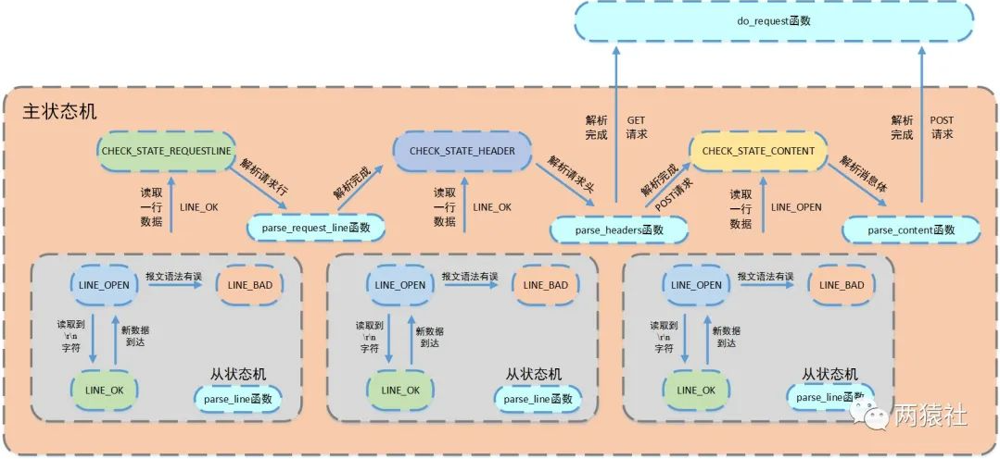

# 项目介绍
- 为什么要做这样一个项目？

- 介绍下你的项目

# 线程池相关
- 手写线程池
```
class ThreadPool
{
public:
    bool append(T* request);
private:
    static void* worker(void* arg);
    void run();             // 线程池运行的函数，不断从请求队列中取出请求并处理

    pthread_t *pthreads_;       // 线程池数组
    std::list<T *> workqueue_;  // 请求队列
    locker queuelocker_;
    sem queuestat_;
    int actorModel_;        // 0:proactor, 1:reactor
};

Threadpool::ThreadPool(int actorModel, int thread_number, int max_requests) : actorModel_(actorModel), thread_number_(thread_number), max_requests_(max_requests), stop_(false), pthreads_(NULL){
    if (thread_number <= 0 || max_requests <= 0){
        throw std::exception();
    }
    pthreads_ = new pthread_t[thread_number_];
    if (!pthreads_) throw std::exception();
    
    for (int i = 0; i < thread_number_; ++i){
        if (pthread_create(pthreads_ + i, NULL, worker, this) != 0){
            delete[] pthreads_;
            throw std::exception();
        }
        if (pthread_detach(pthreads_[i])){
            delete[] pthreads_;
            throw std::exception();
        }
    }
}

bool ThreadPool::append(T* request){
    queuelocker_.lock();
    if (workqueue_.size() > max_requests_){
        queuelocker_.unlock();
        return false;
    }
    workqueue_.push_back(request);
    queuelocker_.unlock();
    queuestat_.post();      // 信号量加1
    return true;
}

void ThreadPool::run(){
    while (true){
        queuestat_.wait();      // 等待信号量
        queuelocker_.lock();
        if (workqueue_.empty()){
            queuelocker_.unlock();
            continue;
        }
        T* request = workqueue_.front();
        workqueue_.pop_front();
        queuelocker_.unlock();
        if (!request)   continue;
        if (actorModel_ == 1){      // reactor
            if (request->readOnce())    request->process();
            else    request->timer_flag = 1;
        }
        else    request->process();     // proactor
    }
}
```

- 线程的同步机制有哪些？

请求队列的同步机制：互斥锁+信号量。先post再wait，保证了线程安全的同时，保证了线程同步。

- 线程池中的工作线程是一直等待吗？

单个线程是一直等待的，但是线程池中的工作线程是不一直等待的，当请求队列中有请求时，会唤醒工作线程。

- 你的线程池工作线程处理完一个任务后的状态是什么？

线程池中的工作线程处理完一个任务后，会继续等待请求队列中的请求，如果请求队列中没有请求，会继续等待。

- 如果同时1000个客户端进行访问请求，线程数不多，怎么能及时响应处理每一个呢？

通过子线程的run调用函数进行while循环, 让每一个线程池中的线程永远都不会终止, 处理完当前任务就去处理下一个，没有任务就一直阻塞在那里等待。 使用半同步/半异步的模型，每个工作线程都维护一个请求队列，这样每个工作线程都可以同时处理多个请求。

- 如果一个客户请求需要占用线程很久的时间，会不会影响接下来的客户请求呢，有什么好的策略呢?

为线程处理请求对象设置处理超时时间, 超过时间先发送信号告知线程处理超时，然后设定一个时间间隔再次检测，若此时这个请求还占用线程则直接将其断开连接。

# 并发模型相关
- 简单说一下服务器使用的并发模型？

半同步/半反应堆模型，主线程负责监听，子线程负责处理请求。支持reactor和模拟proactor两种模式。主线程监听所有socket上的事件(新连接请求，读写事件，时钟信号)，所有工作线程都睡眠在请求队列上，主线程通过信号量唤醒工作线程，工作线程从请求队列中取出请求进行处理。

- reactor、模拟proactor、主从reactor模型的区别？

reactor模型：主线程只负责监听文件描述符上是否有事件发生，有的话就将该事件通知工作线程，工作线程负责处理事件。后将事件通知给工作线程，读写数据、处理客户请求均由工作线程完成。

proactor模型：所有I/O操作都交给主线程和内核来处理，工作线程仅负责业务逻辑处理。

模拟proactor模型：主线程执行数据读写操作，主线程向工作线程通知读写完成事件，工作线程得到数据的读写结果，仅进行逻辑处理。

主从reactor模型：即上面的半同步/半反应堆模型。

- 你用了epoll，说一下为什么用epoll，还有其他复用方式吗？区别是什么？

对于select和poll来说，所有文件描述符都是在用户态被加入其文件描述符集合的，每次调用都需要将整个集合拷贝到内核态；epoll则将整个文件描述符集合维护在内核态，每次添加文件描述符的时候都需要执行一个系统调用。系统调用的开销是很大的，而且在有很多短期活跃连接的情况下，epoll可能会慢于select和poll由于这些大量的系统调用开销。

select使用线性表描述文件描述符集合，文件描述符有上限；poll使用链表来描述；epoll底层通过红黑树来描述，并且维护一个ready list，将事件表中已经就绪的事件添加到这里，在使用epoll_wait调用时，仅观察这个list中有没有数据即可。

select和poll的最大开销来自内核判断是否有文件描述符就绪这一过程：每次执行select或poll调用时，它们会采用遍历的方式，遍历整个文件描述符集合去判断各个文件描述符是否有活动；epoll则不需要去以这种方式检查，当有活动产生时，会自动触发epoll回调函数通知epoll文件描述符，然后内核将这些就绪的文件描述符放到之前提到的ready list中等待epoll_wait调用后被处理。

select和poll都只能工作在相对低效的LT模式下，而epoll同时支持LT和ET模式。

# HTTP报文解析相关
- 用了状态机啊，为什么要用状态机？

因为传统应用程序的控制流程基本是按顺序执行的：遵循事先设定的逻辑，从头到尾地执行。简单来说如果想在不同状态下实现代码跳转时，就需要破坏一些代码，这样就会造成代码逻辑混乱，代码显得十分复杂。所以我们必须采取不同的技术来处理这些情况。它能处理任何顺序的事件，并能提供有意义的响应——即使这些事件发生的顺序和预计的不同，有限状态机正是为了满足这方面的要求而设计的。每个状态都有一系列的转移，每个转移与输入和另一状态相关。当输入进来，如果它与当前状态的某个转移相匹配，机器转换为所指的状态，然后执行相应的代码。

- 状态机的转移图画一下



- https协议为什么安全？

https=http+TLS/SSL

TLS/SSL协议位于应用层协议和TCP之间，构建在TCP之上，由TCP协议保证数据传输版的可靠性，任何数据到权达TCP之前，都经过TLS/SSL协议处理。

- https的ssl连接过程

1. 客户端提交https请求
2. 服务器响应客户，并把证书公钥发给客户端
3. 客户端验证证书公钥的有效性
4. 有效后，会生成一个会话密钥
5. 用证书公钥加密这个会话密钥后，发送给服务器
6. 服务器收到公钥加密的会话密钥后，用私钥解密，回去会话密钥
7. 客户端与服务器双方利用这个会话密钥加密要传输的数据进行通信

- GET和POST的区别

参数位置：GET在url的query中；POST在url的query或请求报文content中
参数大小：GET受限于url大小一般为32k；POST为1G
语义：GET获取资源；POST提交数据

# 数据库登录注册相关
- 登录说一下？

1. 载入数据表就是把数据库的数据通过通过map容器传到服务器上。
2. 当从浏览器上输入用户的用户名和密码后，浏览器会一个post请求报文，服务器通过解析请求报文的消息体，解析出账号密码。
3. 根据解析出的账号密码，与map容器中保存账号密码进行对比校验，相符则成功登陆。注册账号时，同样将输入的账号密码与数据库已经存储的账号名进行对比校验，防止出现相同的账号名。如果不相同就加入数据库。
4. 当输入的账号密码与数据库的数据成功匹配，就将浏览器跳转到对应的界面。

- 你这个保存状态了吗？如果要保存，你会怎么做？（cookie和session）（TODO）

Cookie保存在客户端浏览器中，而Session保存在服务器上。

- 登录中的用户名和密码你是load到本地，然后使用map匹配的，如果有10亿数据，即使load到本地后hash，也是很耗时的，你要怎么优化？

1. sql查询
2. 建立高效的索引

- 用的mysql啊，redis了解吗？用过吗？

mysql是关系型数据库，主要用于存放持久化数据，将数据存储在硬盘中，读取速度较慢。

redis是NOSQL，即非关系型数据库，也是缓存数据库，即将数据存储在缓存中，缓存的读取速度快，能够大大的提高运行效率，但是保存时间有限。

# 定时器相关
- 为什么要用定时器？

- 说一下定时器的工作原理

- 双向链表啊，删除和添加的时间复杂度说一下？还可以优化吗？

- 最小堆优化？说一下时间复杂度和工作原理

# 日志相关
- 说下你的日志系统的运行机制？

- 为什么要异步？和同步的区别是什么？

- 现在你要监控一台服务器的状态，输出监控日志，请问如何将该日志分发到不同的机器上？（消息队列）

# 压测相关
- 服务器并发量测试过吗？怎么测试的？

- webbench是什么？介绍一下原理

- 测试的时候有没有遇到问题？

# 综合能力
- 你的项目解决了哪些其他同类项目没有解决的问题？

- 说一下前端发送请求后，服务器处理的过程，中间涉及哪些协议？